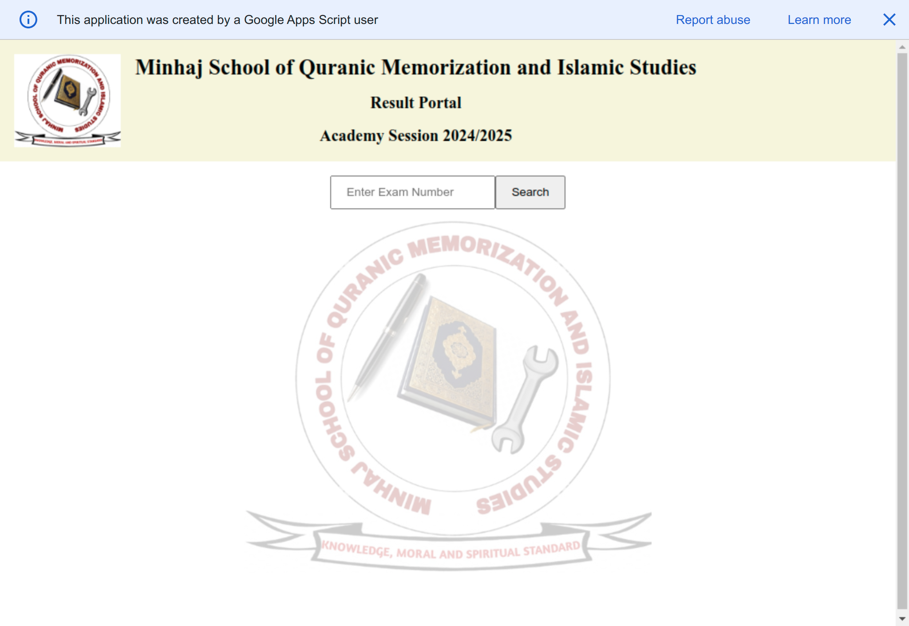
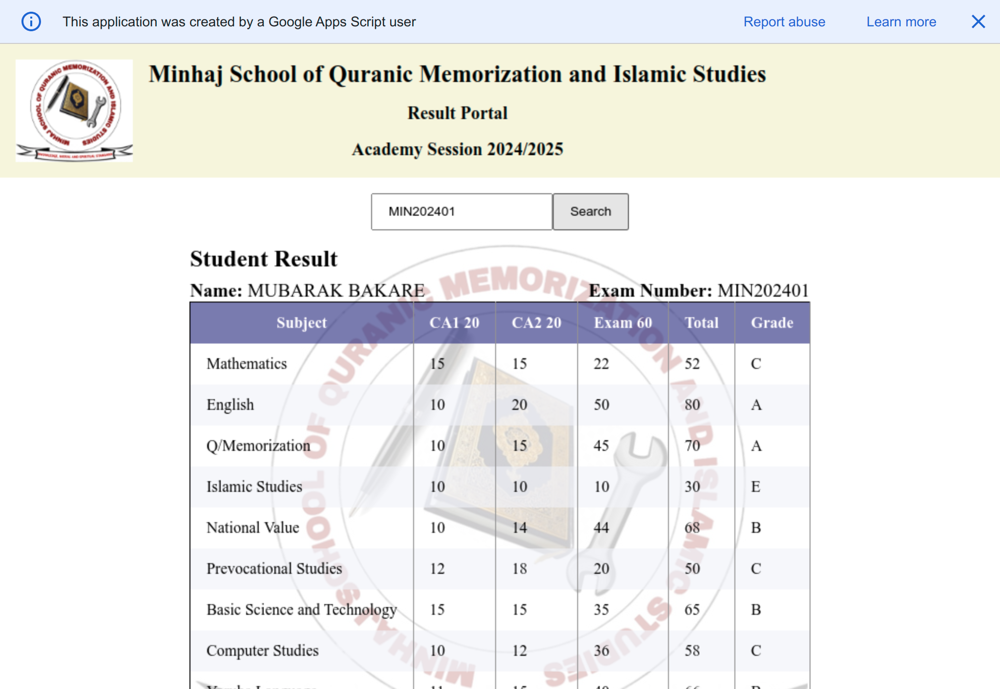
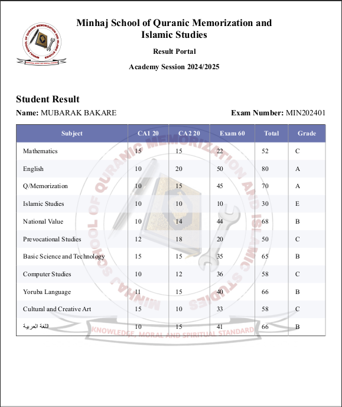

# Minhaj School Result

## Introduction
The Minhaj School Result project uses the Google Apps Script extension with Google Sheets to provide a simple and efficient way for school staff to retrieve student exam results. It eliminates the need for advanced Excel or spreadsheet knowledge, allowing staff to search for a student by their registration number and retrieve their exam details effortlessly.

## How It Works
1. The staff enters the student's exam number.
2. The system searches for the student's record and generates a table displaying the student's data.
3. The staff clicks the print button to print the generated result.

## Screenshots
### Initial Page

### Generated Result

### PDF Print Result

